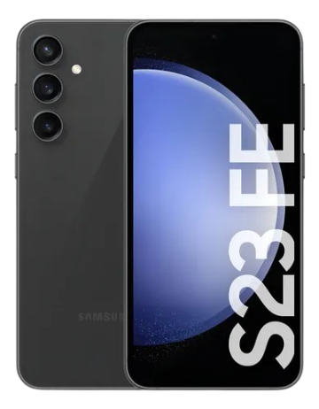

<p align="center">
  
</p>

# GymSync - Show your gym workouts on Discord with RPC
---

[Mobile App](./apps/mobile_app) |
[Presence Desktop](./apps/presence) |
[Host your own backend](#hosting-the-backend-online)

# Running


# Get Started

## Build the Project

You can build **GymSync** using **Makefile**.

```bash
make apk
make desktop-presence

# Platform-specific presence builds
make desktop-presence-windows  # Windows (NSIS installer + portable)
make desktop-presence-linux    # Linux (AppImage + deb)
make desktop-presence-macos     # macOS (DMG + zip)
```

> [!WARNING]
> **Never build the APK or Presence directly by running Flutter, Dart, npm or any other command manually.**
> Always use the **Makefile** targets — Makefile ensure that all checks and replacements run correctly.

---

## Install the APK

1. Build and download it to your device
2. Follow the steps in [Hosting the backend online](#hosting-the-backend-online)
3. Then follow [Setting up Presence](#setting-up-presence)
4. Ready to use!

## Hosting the backend online

1. Create an account at [vercel.com](https://vercel.com)
2. Fork this repository
3. Connect your GitHub account to Vercel
4. Create a new project with your fork, setting the **Root Directory** to: `apps/backend/`
5. Click **Deploy**, then create the `.env` files in `apps/mobile_app` and `apps/presence`, setting the backend URL to the one generated by Vercel

## Setting up Presence

1. Set up your `.env` files and compile the project using the **Makefile** (see [Build the Project](#build-the-project))
2. Run the built presence application - it will automatically:
   - **Add itself to system autostart** (starts with Windows/macOS/Linux)
   - **Run in the background** with a system tray icon
   - **Start minimized** when launched via autostart
3. Keep Discord open at all times (it can be in the background)
4. Log in to Discord through the presence app and it will run continuously in the background

> [!TIP]
> The presence app is designed to run completely in the background. Once set up, it will automatically start with your system and maintain your Discord Rich Presence without any manual intervention.

---

### Supported Platforms

**Mobile App:**
[]()

**Presence App:**
[]()
[]()
[]()

### Tested with:

<p align="center">
  
</p>

## License


# By: [TheusHen](https://theushen.me)
